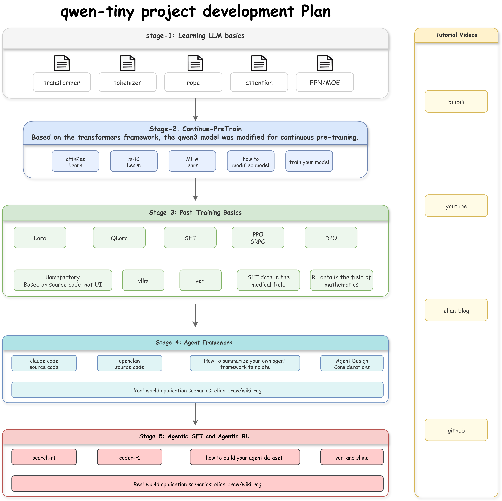

# elian-qwen-tiny: LLM post-training

## 为什么写了这个项目？

愿景是：让每一个学习LLM和Agent的本硕博同学少走弯路，qwen-tiny提供从LLM原理(致力于讲清楚每一个原理细节)到后训练(致力于教会同学们如何魔改模型，并掌握transformers、llamafactory、verl源码)再到agent训练的完整pipeline教程。

预计的教学形式为视频为主，文档为辅

  

## 文档

- [llm的基本原理](/docs/llm_Basic%20principles.md)

- [continue pre-train: attention residual教程与日志 base qwen-0.6B-Base](/docs/continue_pretrained_attnRes.md)在这里您将学习到qwen3的架构详解、transformers的基础用法，并学习到如何使用transformers更改模型结构。

- [lora 微调 base qwen-0.6B-instruct](/docs/continue_pretrained_attnRes.md)在这里您将学习到如何使用transformers进行lora微调
- [全参指令微调 base qwen-0.6B-instruct](/docs/continue_pretrained_attnRes.md)在这里您将学习到如何使用transformers+并行策略(zero-3、fsdp、tp、pp等)进行小模型初步的微调训练，以及如何使用llamafactory后端进行高效训练。在这里您还将学习各个sft框架的优劣，包含：transformers、llamafactroy、ms-swift、xtuner。
- [rlvr-aime+冷启动 base qwen-0.6B-instruct](/docs/continue_pretrained_attnRes.md)在这里您将初步的学习到verl与slime源码，进行强化学习的训练
- [agent sft base qwen-0.6B-instruct](/docs/continue_pretrained_attnRes.md)在这里您将系统的学习到llafactroy后端源码，以及收集agent-sft训练数据的策略、训练的方法等
- [agent rl 包括: general/search/tool call base qwen-0.6B-instruct](/docs/continue_pretrained_attnRes.md)在这里您将系统的学习verl源码，进行更高难度的rl训练。
- [on-policy distillation](/docs/continue_pretrained_attnRes.md)

## 后续会探索的
- mtp训练
- mHC
- 稀疏注意力，比如：csa、hca
- generate reward model

## 训练框架：

- transformers：用于简单的task训练
- llamafactory-改进：基于llamafactory底层源码进行训练，而不是使用前端，最大限度的理解微调代码，便于后续小伙伴们在训推框架上作二次开发
- verl and slime

## 致谢
- 感谢[gouzigouzi](https://github.com/gouzigouzi/attention-residuals-reproduction)提供的attention-residuals代码