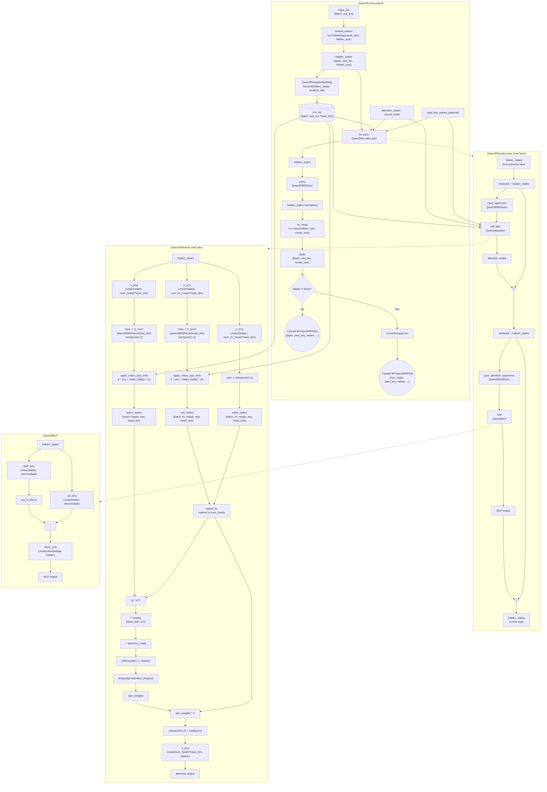

# Continue pre-training using qwen3-base and attention residual method.

## 1. 你为什么需要学习这个项目（以便继续进行 attnRes 的预训练）？

我相信使用持续预训练 addRess 练将提高您对 LLM 架构的理解，并使您能够学习如何使用 transformers 训练模型、改进transformers的模型架构代码。

## 2. Qwen3-0.6B的模型架构详解



图中用 -.-> 表示模块归属关系，并非数据流；数据流全部使用实线箭头。每个子图内部详细展示了计算步骤，包括：

- Embedding：embed_tokens 将 input_ids 映射为隐藏状态。

- RoPE：Qwen3RotaryEmbedding 输出 cos, sin 给所有层的 Attention。

- Attention 结构：Q/K/V 投影、Q/K 的 RMSNorm（q_norm, k_norm）、RoPE 应用 (apply_rotary_pos_emb)、GQA 扩展 (repeat_kv)、缩放点积注意力、o_proj 输出。

- MLP：SwiGLU 结构 (gate_proj + up_proj 相乘后 down_proj)。

- 残差连接：在 Attention 前后和 MLP 前后各有一个残差加法 (residual1/2)。

- RMSNorm：input_layernorm 和 post_attention_layernorm 分别作用于 Attention 和 MLP 的输入，最终还有一个顶层的 norm。

- 输出：lm_head 将最后归一化的隐状态投影到词表，可选地计算交叉熵损失。


## 3. transformers-模型代码详解

## 4. attenRes详解

## 5. 如何修改模型

```python
"""
1. 为什么要定义 config_class？
    为了告诉 Hugging Face 加载器，“我是谁”。
    在 transformers 的底层，有一个全局的注册表（Registry）。当你调用 AutoModel.from_pretrained("你的模型路径") 时，HF 会先去读取路径下的 config.json 文件，找到里面的 "model_type" 字段，然后去注册表里找：“哪个类的 config_class 对应这个 model_type？” 找到了对应的 Config，会解析model的配置参数，然后再找对应的 Model，把config的参数注入到model里面。
"""
class Qwen3AttnResForCausalLM(Qwen3PreTrainedModel, GenerationMixin):
    config_class = Qwen3AttnResConfig  # 👈 绑定关系
# 这行代码相当于贴了个标签：“我是一个特殊的 Qwen3 模型，请用 Qwen3AttnResConfig 这个规则来解析我的参数，不要用原生的 Qwen3Config。”
"""
2. PreTrainedConfig 是干嘛的？Qwen3Config 是干嘛的？
    PreTrainedConfig (基类)
        它是 HF 所有模型配置的老祖宗。它的核心职责是序列化和反序列化。
            保存时：把 Python 对象变成 config.json 文件。（序列化）
            加载时：读取 config.json，变成 Python 对象。（反序列化）
            它还处理一些通用逻辑，比如 kwargs 的容错、设备放置等。
class Qwen3Config(PreTrainedConfig):
    model_type = "qwen3"  # 👈 注册到 HF 全局表里的名字 你可以把 PreTrainedConfig 想象成一张空白表格有字段信息但没有value，Qwen3Config 就是把 Qwen3 的默认参数印在了这张表格上。
"""
class Qwen3AttnResConfig(Qwen3Config):
    model_type = "qwen3_attnres" # 1. 必须换名字！否则会和原版 Qwen3 冲突

    def __init__(self, 
                 attnres_num_blocks: int = 8,          # 2. 新参数：把模型分成几个 Block？
                 attnres_recency_bias_init: float = 3.0,# 3. 新参数：近期偏置的初始值
                 attnres_mode: str = "block",           # 4. 新参数：AttnRes 的模式（分组还是全层）
                 attnres_gate_type: str = "bias",       # 5. 新参数：门控类型（偏置还是 sigmoid）
                 **kwargs):                             # 6. 接收原版 Qwen3 的所有参数
"""
Qwen3AttnResModel (骨干模型的 forward)：是**“大脑”**，负责把文字变成高维向量，进行复杂的注意力计算。
Qwen3AttnResForCausalLM (最终模型的 forward)：是**“嘴巴”**，负责把大脑想出来的高维向量，翻译成具体的下一个汉字/单词，并算算自己猜得准不准（Loss）。
一、 两个 forward 的核心区别
维度	Qwen3AttnResModel.forward (大脑)	Qwen3AttnResForCausalLM.forward (嘴巴)
输入	只有基础特征（input_ids, attention_mask 等）	基础特征 + labels（正确答案，用于算损失）
核心动作	1. 词嵌入
2. 跑你的魔改 AttnRes 层
3. 算辅助熵 (entropy_accum)	1. 调用大脑 (self.model(...))
2. 投射到词表 (self.lm_head)
3. 算交叉熵损失
输出对象	BaseModelOutputWithPast
(只包含 last_hidden_state 隐藏向量)	CausalLMOutputWithPast
(包含 logits 词表概率 和 loss 标量损失)
能否直接对话	❌ 不能。吐出来的是矩阵，人看不懂	✅ 能。结合 GenerationMixin 可以直接打字
二、 @merge_with_config_defaults 是什么？
作用：自动填充配置文件里的默认参数。
痛点： 现代大模型的 forward 函数参数多达二三十个。很多参数其实用户不需要传，直接用 config.json 里的默认值就行。以前的做法是在函数开头写一堆 if xxx is None: xxx = self.config.xxx，代码极其臃肿。

它的魔法：

@merge_with_config_defaults
def forward(self, input_ids, attention_mask=None, use_cache=None, ...):
    pass
当你调用 model.forward(input_ids=[1,2,3]) 时（没传 use_cache），这个装饰器会在执行前偷偷去看一眼 self.config.use_cache，如果配置里是 True，它就会自动把 True 塞进 use_cache 参数里。实现了“缺什么，自动从 config 里补什么”。

三、 @capture_outputs 是什么？
作用：调试神器和中间特征提取器。
痛点： 深度学习最难的是解释模型内部到底发生了什么。如果你想提取第 10 层的注意力权重或者隐藏状态，以前你得去改 Qwen3AttnResDecoderLayer 的代码，把中间变量 return 出来，非常侵入式。

它的魔法：
加了这玩意后，你可以用极其优雅的方式在外部抓取数据：


from transformers import CaptureOutput

# 开启抓捕模式，指定要抓第 0 层和第 5 层的输出
with CaptureOutput(module=model.model, module_names=["layers.0", "layers.5"]) as captured:
    model(input_ids=...)

# 循环结束后，直接拿数据
layer_0_output = captured["layers.0"]
这个装饰器在底层劫持了 forward 的返回值，检查当前是否处于 with CaptureOutput 上下文中，如果是，就把中间结果存一份，不影响正常的模型运行。对你研究 AttnRes 机制非常有用！
四、 @auto_docstring 是什么？
作用：解放双手的文档生成器。
痛点： 看你代码里那一大段 """ Run the Qwen3AttnRes decoder stack. Args: input_ids: Token... """，这其实是手动写的。但 HF 框架要求所有模型的文档格式必须高度统一，手动写很容易漏掉类型提示或者格式错乱。

它的魔法：
其实你可以把函数里那一大段手动写的文档全部删掉，只留一个空的 """ """ 或者干脆不写。@auto_docstring 会在 Python 解释器加载这个类的时候，自动读取函数签名（input_ids: torch.LongTensor | None = None）以及你在父类里写的注释，动态拼装成一份完美的、符合 HF 规范的 Docstring。
你看到的那个完美的文档，大概率有一部分（或全部）是这个装饰器在运行时自动注入的。

总结图景
当你执行 model.generate("你好") 时，实际的调用链是这样的：


用户调用 generate()
      │
      ▼ (GenerationMixin 控制循环)
Qwen3AttnResForCausalLM.forward (带 labels=None)
      │
      ├─ @auto_docstring (帮你生成帮助文档)
      ├─ @merge_with_config_defaults (偷偷补齐 use_cache=True 等参数)
      │
      ▼ 调用大脑
Qwen3AttnResModel.forward
      │
      ├─ @capture_outputs (暗中观察，看你是否需要提取中间层)
      │
      ▼ 核心计算
跑 32 层 Qwen3AttnResDecoderLayer (维护 blocks 和 partial_block)
      │
      ▼ 返回大脑结果 (隐藏向量 + 熵)
回到 Qwen3AttnResForCausalLM.forward
      │
      ▼ 过 lm_head 变成词表概率
返回 logits 给 generate() -> 选出下一个字 "！"
"""
```

## 6. 训练参数详解

## 7. Trainer详解

## 8. 训练过程记录

| Model | Chinese Held-out PPL | C-Eval Acc | CMMLU Acc |
|-------|----------------------|------------|-----------|
| Baseline (Standard Residual) | 41.79 | 0.2314 | 0.2437 |
| Full Attention Residuals | 60.08 | 0.2402 | 0.2437 |
| Block Attention Residuals | 38.95 | 0.2838 | 0.2437 |
