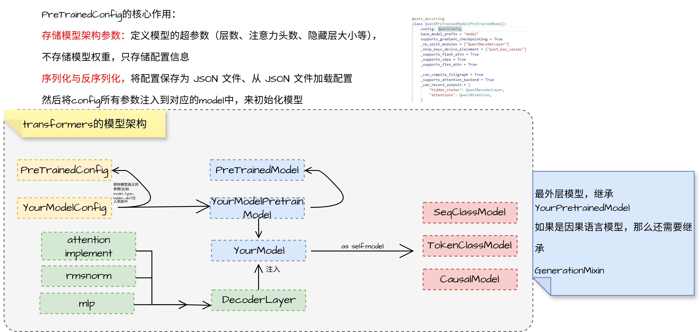
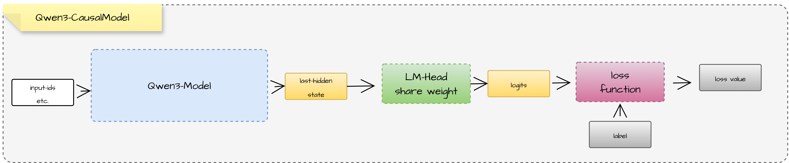
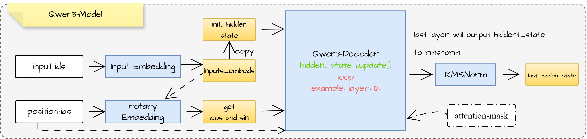
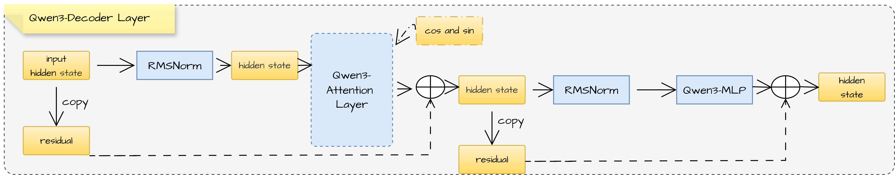
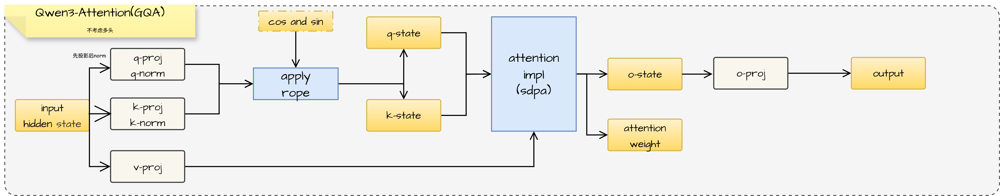
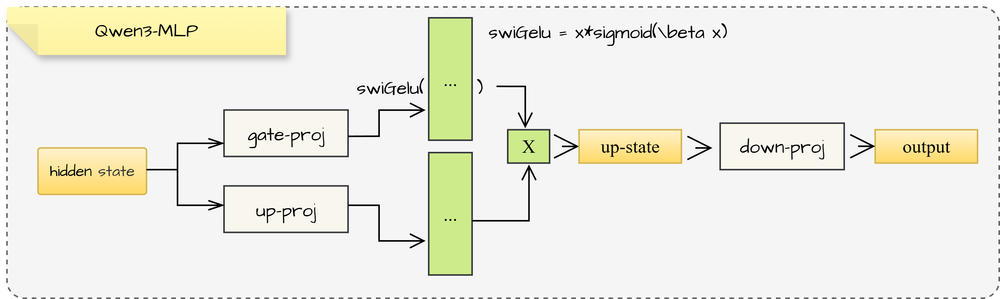

# llm的基本工作原理

## 1. 输入数据

## 2. tokenizer

## 3. embedding

## 4. 位置编码

### 4.1 绝对位置编码

### 4.2 rope位置编码

## 5. attention模块

## 6. norm与残差模块

## 7. ffn与moe

## 8. lm_head模块

## 9. transformers的模型源码解读

  

  

  

  

  

  

